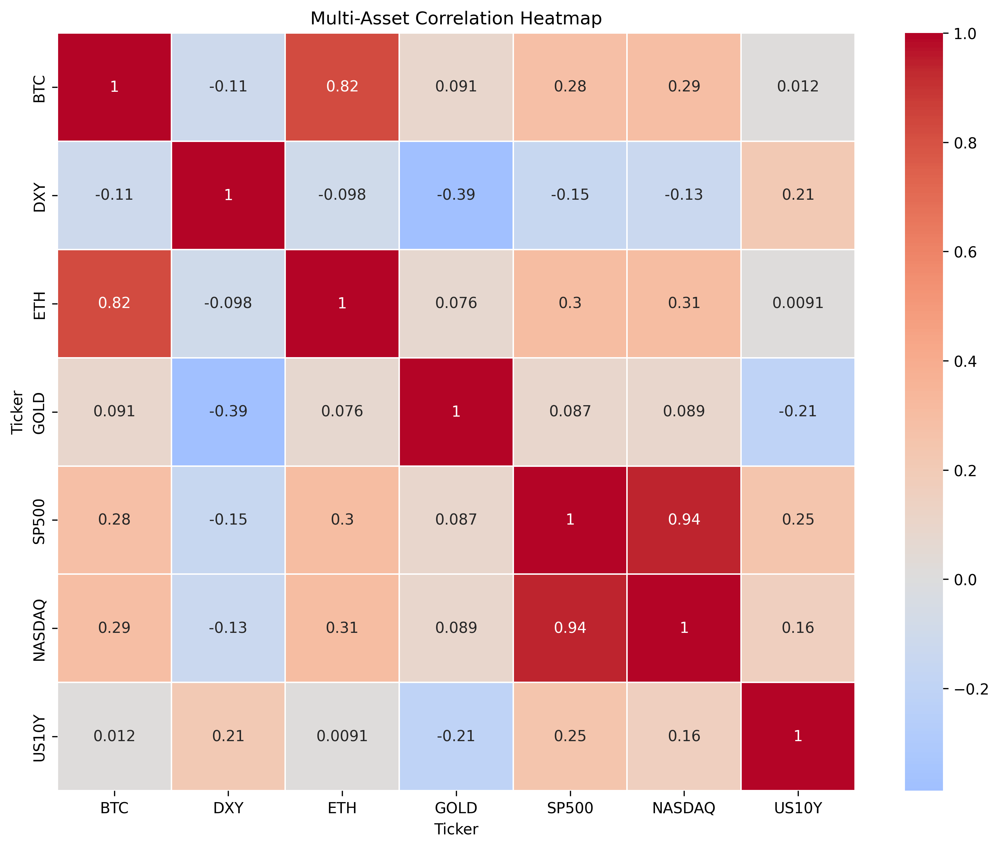
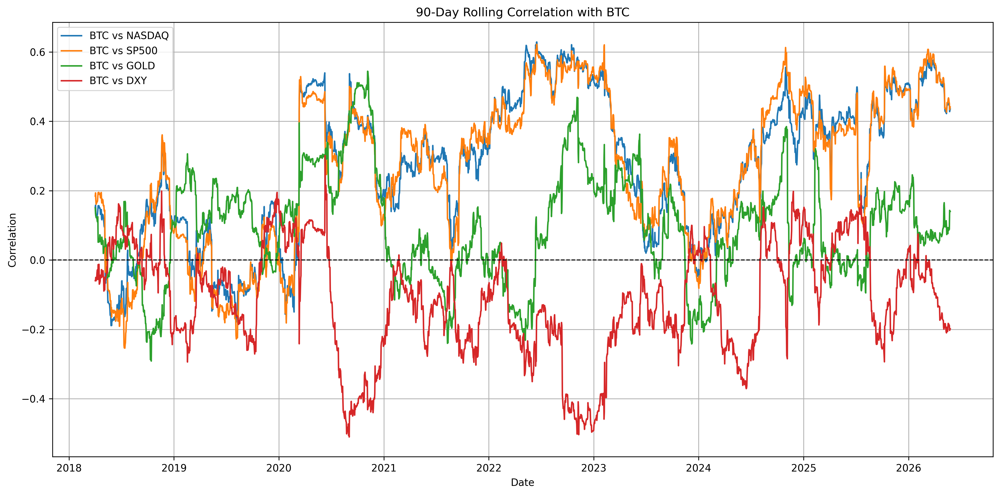

# Crypto Macro Correlation Analysis

## Project Overview

This project analyzes the relationship between Bitcoin and major macro/traditional financial assets including:

- Ethereum (ETH)
- Nasdaq
- S&P 500
- Gold
- US Dollar Index (DXY)
- US 10-Year Yield

The objective is to understand how Bitcoin behaves across different market environments and whether it behaves more similarly to:

- speculative technology assets,
- macro liquidity assets,
- or defensive stores of value.

The project includes:

- historical market data collection,
- volatility analysis,
- cross-asset correlation analysis,
- rolling correlation regime analysis,
- and macroeconomic interpretation.

## Technologies Used

- Python
- Pandas
- NumPy
- Matplotlib
- Seaborn
- yFinance
- Jupyter Notebook

## Project Structure

```text
crypto-macro-correlation-analysis/
│
├── data/
│   ├── raw/
│   └── processed/
│
├── notebooks/
│   └── 01_data_collection.ipynb
│
├── reports/
│   └── figures/
│
├── src/
│
├── README.md
├── requirements.txt
└── .gitignore
```

## Key Analysis Performed

### 1. Historical Market Data Collection

Downloaded historical price data for:

- BTC
- ETH
- Nasdaq
- S&P 500
- Gold
- DXY
- US10Y

### 2. Data Cleaning & Alignment

- Forward-filled missing macro market dates
- Removed incomplete rows
- Standardized multi-asset datasets

### 3. Volatility Analysis

- Daily returns calculation
- Annualized volatility comparison
- Cross-asset risk comparison

### 4. Correlation Analysis

- Static correlation matrix
- Correlation heatmap visualization
- Cross-market relationship analysis

### 5. Rolling Correlation Analysis

- 90-day rolling correlation
- BTC vs Nasdaq
- BTC vs S&P 500
- BTC vs Gold
- BTC vs DXY

### 6. Macro Regime Interpretation

- Risk-on vs risk-off analysis
- Liquidity cycle interpretation
- Macro sensitivity observations

## Key Findings

- Bitcoin and Ethereum maintained strong positive correlation throughout most market regimes.
- Bitcoin displayed increasing correlation with equities during liquidity-driven cycles.
- Bitcoin showed weak long-term correlation with Gold, challenging the "digital gold" narrative.
- DXY generally maintained negative correlation with Bitcoin and risk assets.
- Bitcoin's relationship with traditional assets is regime-dependent and changes with liquidity, dollar strength, and risk appetite.

## Results Summary

Key statistical observations from the analysis:

- BTC ↔ ETH correlation: 0.82
- S&P 500 ↔ NASDAQ correlation: 0.94
- BTC ↔ GOLD correlation: 0.09
- BTC ↔ DXY correlation: -0.11

Annualized volatility comparison:

- ETH: 0.70
- BTC: 0.53
- NASDAQ: 0.20
- DXY: 0.06

Key macro observations:

- Bitcoin became increasingly correlated with equities after 2020.
- Bitcoin maintained weak and inconsistent correlation with Gold across market regimes.
- DXY generally showed inverse behavior relative to crypto and risk assets.
- Crypto assets demonstrated significantly higher volatility than traditional macro assets.

## Example Visualizations

### Multi-Asset Correlation Heatmap



### 90-Day Rolling Correlation with BTC



## Future Improvements

Potential future extensions include:

- regime classification models,
- macro event overlays,
- machine learning forecasting,
- portfolio optimization analysis,
- and interactive dashboards using Streamlit.

## Installation

Clone the repository:

```bash
git clone https://github.com/rkaban-personal/crypto-macro-correlation-analysis.git
cd crypto-macro-correlation-analysis
```

Install dependencies:

```bash
pip install -r requirements.txt
```

Launch Jupyter Notebook:

```bash
jupyter notebook
```

## Portfolio Note

This project was built as part of a progressive data science portfolio focused on financial markets, macroeconomic analysis, and cryptocurrency research.